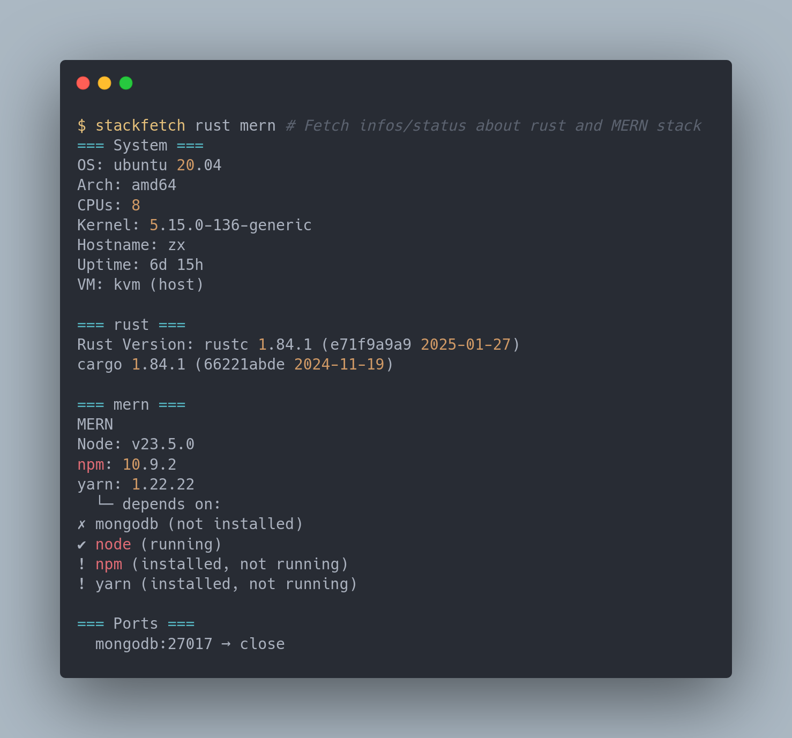

## STACKFETCH

> Heavily inspired by how [neofetch](https://github.com/dylanaraps/neofetch) works in principle, but for your stack/language/services....



Ever got an issue from someone on a project and you can't reproduce on your side ?
But then asking to run a bunch of command line to get like, the version of his cli/package-manager/system environment, what is the processor... ?

As a maintainer, yes, me too...

Meet `stackfetch`, with a provided programming language or just a stack, you are going to have all informations you want to help debuguing.
even regarding services or ports opened / closed.

## FEATURES

- **Cross‑platform**: Linux, macOS, Windows (amd64 & arm64) with graceful fall‑backs for BSD and WSL.
- **Structured output**: choose plain text or `--json` for CI pipelines and issue templates.
- **Batteries included**: 60 + language runtimes, DevOps tools, and deployment stacks pre‑wired.
- **Shell completion**: `stackfetch completion bash|zsh|fish|powershell` for instant CLI hints.
- **Guess Mode**: `Automatically guess the stack of the current directory project.`
    `stackfetch guess # or just : stackfetch ?`
- **Services status:** Checks for running services from which the stack depends on.
- **Services port:** Checks for opened port regarding services from which the stack depends on.

## HOW TO INSTALL

### LINUX (DEBIAN/UBUNTU)

```bash
VERSION=v0.0.7 # the version you want (or latest)
ARCH=$(dpkg --print-architecture)              # e.g. amd64
URL="https://github.com/sanix-darker/stackfetch/releases/download/${VERSION}/stackfetch-ubuntu-${ARCH}.deb"
# Download and install:
curl -fsSL "$URL" -o stackfetch.deb
sudo dpkg -i stackfetch.deb

# (Optional) Clean up:
rm stackfetch.deb
```

### DEV INSTALL

```bash
go install github.com/sanix-darker/stackfetch/cmd/stackfetch@latest  # source build
# — or — (depending on the OS you're using)
wget https://github.com/Sanix-Darker/stackfetch/releases/download/v0.0.2/stackfetch-ubuntu-amd64
sudo chmod +x stackfetch-* && sudo mv stackfetch-* /usr/local/bin/stackfetch
```

### WINDOWS

```bash
scoop bucket add stackfetch https://github.com/yourname/scoop-bucket
scoop install stackfetch
```

## HOW TO USE

```bash
stackfetch                         # system only (BLAZINGLY fast)
stackfetch node python docker      # add Node, Python, Docker info
stackfetch mean lamp --json        # JSON report for MEAN & LAMP stacks


# Guess mode example :
$ stackfetch ?
=== System ===
OS: ubuntu 20.04
Arch: amd64
CPUs: 8
Kernel: 5.15.0-136-generic
Hostname: zx
Uptime: 6d 3h
VM: kvm (host)

Guessed: .
Detected items: [go]

=== go ===
Go Version: go version go1.20 linux/amd64
Module file: /home/dk/github/stackfetch/go.mod
```

## CONTRIBUTORS

- [sanixdk](https://github.com/sanix-darker)

## LICENSE

**[MIT](./LICENSE)**
